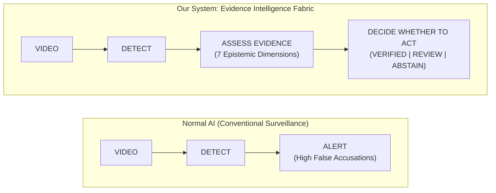

# Evidence Intelligence & Compliance Fabric (SIH26245)

**Smart India Hackathon 2026 — Problem Statement SIH26245**  
*AI-Based Real-Time Monitoring of Training Centres for Attendance and Infrastructure Compliance*  
**Core Innovation:** **Detection Confidence ≠ Decision Confidence (Assess Evidence Before Action)**

---

## 1. Paradigm Shift



Conventional surveillance AI triggers punitive alerts whenever an object or person detection threshold is crossed. This causes wrongful penalties due to optical blur, lens occlusion, transient passersby, or camera freezes.

**Evidence Intelligence gates compliance through an isolated Evidence Sufficiency Engine** that evaluates whether observational evidence is *epistemically trustworthy* before taking administrative action, and explicitly **ABSTAINS** when evidence is insufficient.

---

## 2. The 8-Stage End-to-End Architectural Pipeline

```mermaid
flowchart TD
    S1["1. EDGE VIDEO INGESTION\n• RTSP / HTTP\n• Local ring buffering\n• Adaptive frame sampling\n• Keyframe compression\n• Store-and-forward"] --> S2["2. AI PERCEPTION\n• Anonymous person detection (YOLOv8n)\n• Equipment detection\n• Configurable zone polygons\n• Anonymous presence estimation"]
    
    S2 --> S3["3. SCENE & SENSOR TRUST\n• FPS / connectivity cadence\n• Optical blur (Laplacian variance)\n• Brightness & exposure histogram\n• Camera obstruction / cover\n• Freeze / replay indicators (pixel entropy)\n• Field of view coverage"]

    S3 --> S4["4. TEMPORAL & STATE VALIDATION\n• Temporal persistence (continuous dwell)\n• Occlusion handling (ByteTrack kalman)\n• State transition machine (ENTER->DWELL->EXIT)\n• Scene background stability\n• Short-window evidence accumulation (10-min epoch)"]

    S4 --> S5["5. EVIDENCE SUFFICIENCY ENGINE (CORE INVENTION)\n• Camera Trust (w=0.15)\n• Observability (w=0.15)\n• Detection Quality (w=0.15)\n• Temporal Persistence (w=0.20)\n• Scene Stability (w=0.10)\n• Record Agreement (w=0.10)\n• Anti-Spoof Signals (w=0.15)\n\nOUTPUT: VERIFIED | REVIEW | ABSTAIN"]

    S5 --> S6["6. COMPLIANCE REASONING\n• CCTV Attendance vs Biometric Register\n• Approved Infra. vs Observed Infra.\n• EVIDENCE LADDER:\n  [1] PRESENT -> [2] VISIBLE ->\n  [3] APPARENTLY AVAILABLE -> [4] APPARENTLY USABLE\n  ('CCTV cannot prove true machine function; requires IoT/manual evidence.')"]

    S6 --> S7["7. EVIDENCE ACQUISITION (CLOSED LOOP)\nINSUFFICIENT EVIDENCE -> MORE OBSERVATION -> RE-EVALUATE\n• Wait for next 10-min observation window\n• Check alternate camera (CAM-02)\n• Collect more temporal frames (1->5 fps)\n• Human vigilance verification"]

    S7 --> S8["8. HUMAN GOVERNANCE (HUMAN-IN-THE-LOOP)\n• Presiding Officer: CONFIRM | REJECT | REQUEST INSPECTION\n• Immutable Evidence Package & Keyframe Vault\n• Decision History (Never overwrites AI)\n• Cryptographic HMAC-SHA256 Audit Trail\n• Privacy-controlled RBAC (Admin / Auditor)"]
```



---

## 3. Low-Bandwidth Event Telemetry & Privacy Safeguards

| Feature | Conventional AI | Evidence Intelligence Fabric |
| :--- | :--- | :--- |
| **Cloud Video Streaming** | 24/7 continuous raw stream (2.5 - 4.0 Mbps per camera) | **AVOIDED (0 Mbps stream)** — All CV inference executed locally at Edge |
| **Telemetry Payload** | Gigabytes of video footage per day | **~4.2 KB cryptographically sealed JSON Evidence Passport** |
| **Bandwidth Efficiency** | Baseline (100% saturation) | **99.8% Data Reduction** |
| **Privacy Safeguards** | PII risk, facial scans, biometric capture | **Zero Facial Recognition** — Local anonymous bounding boxes & centroid seating only |
| **Tamper Resistance** | Easily forged central logs | **SHA-256 Hashes + HMAC-SHA256 Digital Signatures + Immutable Hash Chaining** |

---

## 4. The Evidence Ladder (Stage 6)

In compliance auditing, visual observation has inherent epistemic boundaries. Our system models this via a 4-level **Evidence Ladder**:

```
Level 4: APPARENTLY USABLE    --> Machine is in an active workstation with power indicator.
Level 3: APPARENTLY AVAILABLE --> Asset is unblocked and accessible in the training room.
Level 2: VISIBLE              --> Clear unoccluded line-of-sight from camera sensor.
Level 1: PRESENT              --> Asset or trainee is situated within physical room boundary.
```

> [!IMPORTANT]
> **Epistemic Axiom:** *"CCTV optical evidence cannot prove true machine functional calibration; requires IoT power sensor or manual audit verification."*

---

## 5. Automated Evidence Acquisition Feedback Loop (Stage 7)

When an evaluation produces `ABSTAIN` (Insufficient Evidence) or `REVIEW` (Ambiguous or Discrepant), the system executes a closed-loop acquisition strategy rather than levying immediate false penalties:

1. **Wait for Next Window:** If temporal persistence fails (transient passerby), the engine delays decision until the next 10-minute training epoch.
2. **Check Alternate Camera:** If the primary sensor experiences optical occlusion or blur, the controller queries secondary camera angles (`CAM-02`) in the same training room.
3. **Collect More Temporal Data:** Keyframe sampling rate dynamically escalates from 1 fps to 5 fps across a 15-minute sliding window to resolve ambiguity.
4. **Human Verification:** Confirmed discrepancies (e.g. Ghost Batch: 4 visual trainees observed vs 25 on official register) are routed to the **Human Governance Review Queue**.

---

## 6. Complete Technology Stack

```
┌─────────────────────────────────────────────────────────────────────────┐
│                      EVIDENCE INTELLIGENCE TECH STACK                   │
├──────────────────────┬────────────────────────┬─────────────────────────┤
│ Layer                │ Technology             │ Function                │
├──────────────────────┼────────────────────────┼─────────────────────────┤
│ Computer Vision      │ Lightweight YOLO       │ Anonymous bbox detection│
│ Tracking             │ ByteTrack / BoT-SORT   │ Kalman state persistence│
│ Temporal Validation  │ Sliding-Window FSM     │ Continuous 10-min dwell │
│ Edge Runtime         │ ONNX / OpenVINO / TRT  │ Low-latency on premise  │
│ Backend Server       │ Python 3.10+ / FastAPI │ Async REST API & Engine │
│ Database & Ledger    │ SQLite / PostgreSQL    │ Relational & Event Store│
│ Mission Dashboard    │ Next.js 16 / Turbopack │ Reactive Governance UI  │
│ Security & Integrity │ TLS, SHA-256, HMAC     │ Non-repudiation sealing │
└──────────────────────┴────────────────────────┴─────────────────────────┘
```

---

## 7. Automated Test Suite (Phases 1 to 5)

All components are backed by automated verification test suites:

```bash
# Phase 1: Database & Relational Management APIs
python backend/test_phase1_api.py

# Phase 2: Edge AI Perception & Temporal Pipeline
python backend/test_phase2_pipeline.py

# Phase 3: Evidence Sufficiency Engine (7 Epistemic Dimensions)
python backend/test_phase3_sufficiency.py

# Phase 4: Evidence Passport Cryptographic Sealing & Tamper Detection
python backend/test_phase4_passport_audit.py

# Phase 5: Human Governance & Multi-Stage Adjudication
python backend/test_phase5_governance.py
```

---

## 8. Quick Start Instructions

### Prerequisites
- Python 3.10+
- Node.js v18+ and npm

### 1. Start the Backend API Server
```bash
python -m uvicorn backend.app.main:app --host 127.0.0.1 --port 8000
```
- API Health Probe: `http://127.0.0.1:8000/api/v1/health`
- Swagger Documentation: `http://127.0.0.1:8000/docs`

### 2. Start the Frontend Dashboard
```bash
cd frontend
npm run dev
```
Open [http://localhost:3000](http://localhost:3000) in your browser.

### 3. Officer Authentication
The console is protected behind an **Officer Authentication Gate**:
- **Admin Presets:** `username: admin` | `password: admin123`
- **Auditor Presets:** `username: officer_rajesh` | `password: officer123`
- Click **"Authenticate & Enter Console"** to unlock the Evidence Fabric, Training Centres, Evidence Passports Vault, and Human Governance Review Queue.
